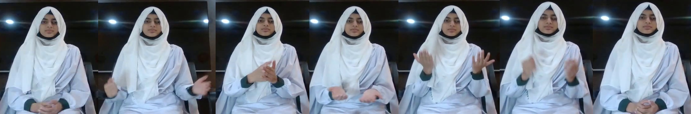
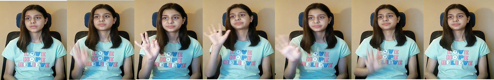
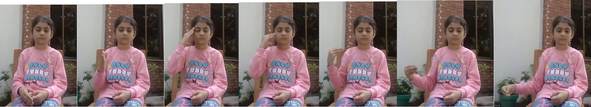
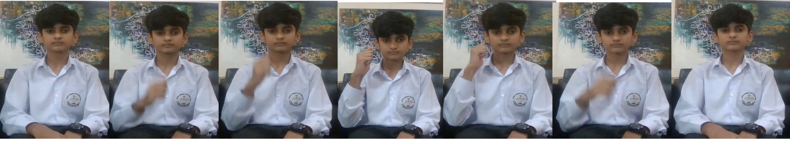
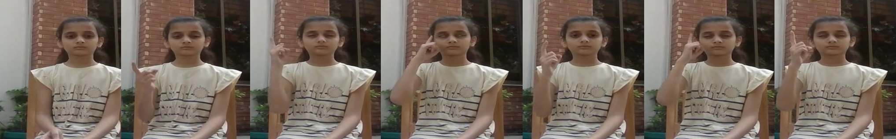
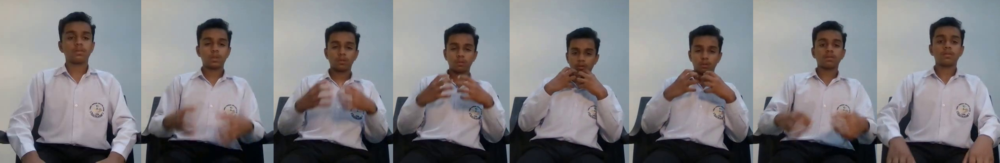
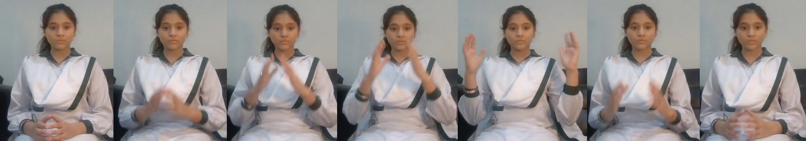

# Sign Language Interpreter using Deep Learning
> Sign language is the primary mode of communication for the hearing-impaired community. While global sign languages like ASL are well-resourced, regional languages such as Pakistan Sign Language (PSL) suffer from a lack of datasets and advancements, especially for safety-critical applications. To address this gap, we propose a Sign Language Action Recognition (SLAR) framework tailored for Safe City Surveillance to detect emergency signals and distress gestures.
   A key contribution of this work is the introduction of a new video dataset, the Lahore Garrison Institute of Special Education - Safe City Sign Dataset (LGISE-SCSD), captured under diverse environmental conditions to simulate real-world surveillance scenarios. Our methodology employs a Two-Stream Multi-Modal Ensemble, combining a Video Swin Transformer (Swin3D) for spatiotemporal feature extraction from RGB video with a Channel-Topology Refined Graph Convolutional Network (CTR-GCN) to model geometric dependencies from skeletal pose data. While Swin3D and CTR-GCN achieved standalone validation accuracies of 93.28\% and 85.99\% respectively, our optimized late fusion ensemble strategy significantly enhances performance. By effectively mitigating challenges like motion blur and background clutter, the combined framework attains a robust final recognition accuracy of 96.06\%, establishing an authenticated baseline for integrating deep learning-based sign language recognition into urban surveillance networks.. 

## Table of contents
* [General info](#general-info)
* [Dataset](#Dataset)
* [Technologies and Tools](#technologies-and-tools)
* [Preprocess](#Preprocess)
* [Code Examples](#code-examples)
* [Features](#features)
* [Status](#status)
* [Future Work](#future-work)
* [Citation](#citation)
* [Contact](#contact)

## General info

We propose an intelligent real-time sign language recognition framework specifically designed for Pakistan Sign Language (PSL), especially in safety-critical contexts of safe city surveillance systems. The system leverages state-of-the-art deep learning models and is trained on an annotated dataset that reflects the local cultural and contextual variations of PSL, including traditional and region-specific gestures.  
A multimodal sign language action recognition (SLAR) framework based on a dual-stream, RGB–skeleton architecture. The model fuses 3D-CNN appearance features with pose-based motion features to jointly exploit spatial and temporal information.
We introduce a Pakistan Sign Language video dataset captured under diverse environmental conditions to emulate real-world safe-city surveillance scenarios. The dataset was collected under the supervision of the Lahore Garrison Institute of Special Education and termed the Safe City Sign Dataset (LGISE-SCSD). It is a multi-class, annotated PSL video corpus recorded from more than 10 signers across different backgrounds and lighting conditions.

## 📊 Dataset: LGISE-SCSD
The Lahore Garrison Institute of Special Education - Safe City Sign Dataset consists of:
Total Samples: 6,193 videos.
Classes: Accident, Dangerous, Dead, Difficult, Dizzy, Scared, Violent.
Conditions: Recorded with 10+ signers across varying lighting, backgrounds, and camera angles to simulate real-world urban surveillance.
Complete dataset can be downloaded from https://www.kaggle.com/datasets/havockhan/sign-language-ident-for-safe-city-surveillance

<h3>LGISE-SCSD Dataset Statistics</h3>

<table border="1" cellpadding="8" cellspacing="0">
  <thead>
    <tr>
      <th>Statistic</th>
      <th>Value</th>
    </tr>
  </thead>
  <tbody>
    <tr>
      <td>Total videos</td>
      <td>6,193</td>
    </tr>
    <tr>
      <td>Number of classes</td>
      <td>7</td>
    </tr>
    <tr>
      <td>Average videos per class</td>
      <td>884</td>
    </tr>
    <tr>
      <td>Number of signers</td>
      <td>10+</td>
    </tr>
    <tr>
      <td>Train / Val / Test split</td>
      <td>75% / 15% / 10%</td>
    </tr>
  </tbody>
</table>

## Signs frames















## Technologies and Tools
* Python 
* TensorFlow
* Keras
* OpenCV

## Preprocess

* Use comand promt to setup environment by using requirments.txt and config.yaml files. 
 
`pyton -m pip r install_packages.txt`

This will help you in installing all the libraries required for the project.

## Process

* Run `set_hand_histogram.py` to set the hand histogram for creating gestures. 
* Once you get a good histogram, save it in the code folder, or you can use the histogram created by us that can be found [here](https://github.com/harshbg/Sign-Language-Interpreter-using-Deep-Learning/blob/master/Code/hist).
* Added gestures and label them using OpenCV which uses webcam feed. by running `create_gestures.py` and stores them in a database. Alternately, you can use the gestures created by us [here](https://github.com/harshbg/Sign-Language-Interpreter-using-Deep-Learning/tree/master/Code).
* Add different variations to the captured gestures by flipping all the images by using `Rotate_images.py`.
* Run `load_images.py` to split all the captured gestures into training, validation and test set. 
* To view all the gestures, run `display_gestures.py` .
* Train the model using Keras by running `cnn_model_train.py`.
* Run `final.py`. This will open up the gesture recognition window which will use your webcam to interpret the trained American Sign Language gestures.  

## Code Examples

````
# Model Traiining using CNN

import numpy as np
import pickle
import cv2, os
from glob import glob
from keras import optimizers
from keras.models import Sequential
from keras.layers import Dense
from keras.layers import Dropout
from keras.layers import Flatten
from keras.layers.convolutional import Conv2D
from keras.layers.convolutional import MaxPooling2D
from keras.utils import np_utils
from keras.callbacks import ModelCheckpoint
from keras import backend as K
K.set_image_dim_ordering('tf')

os.environ['TF_CPP_MIN_LOG_LEVEL'] = '3'

def get_image_size():
	img = cv2.imread('gestures/1/100.jpg', 0)
	return img.shape

def get_num_of_classes():
	return len(glob('gestures/*'))

image_x, image_y = get_image_size()

def cnn_model():
	num_of_classes = get_num_of_classes()
	model = Sequential()
	model.add(Conv2D(16, (2,2), input_shape=(image_x, image_y, 1), activation='relu'))
	model.add(MaxPooling2D(pool_size=(2, 2), strides=(2, 2), padding='same'))
	model.add(Conv2D(32, (3,3), activation='relu'))
	model.add(MaxPooling2D(pool_size=(3, 3), strides=(3, 3), padding='same'))
	model.add(Conv2D(64, (5,5), activation='relu'))
	model.add(MaxPooling2D(pool_size=(5, 5), strides=(5, 5), padding='same'))
	model.add(Flatten())
	model.add(Dense(128, activation='relu'))
	model.add(Dropout(0.2))
	model.add(Dense(num_of_classes, activation='softmax'))
	sgd = optimizers.SGD(lr=1e-2)
	model.compile(loss='categorical_crossentropy', optimizer=sgd, metrics=['accuracy'])
	filepath="cnn_model_keras2.h5"
	checkpoint1 = ModelCheckpoint(filepath, monitor='val_acc', verbose=1, save_best_only=True, mode='max')
	callbacks_list = [checkpoint1]
	#from keras.utils import plot_model
	#plot_model(model, to_file='model.png', show_shapes=True)
	return model, callbacks_list

def train():
	with open("train_images", "rb") as f:
		train_images = np.array(pickle.load(f))
	with open("train_labels", "rb") as f:
		train_labels = np.array(pickle.load(f), dtype=np.int32)

	with open("val_images", "rb") as f:
		val_images = np.array(pickle.load(f))
	with open("val_labels", "rb") as f:
		val_labels = np.array(pickle.load(f), dtype=np.int32)

	train_images = np.reshape(train_images, (train_images.shape[0], image_x, image_y, 1))
	val_images = np.reshape(val_images, (val_images.shape[0], image_x, image_y, 1))
	train_labels = np_utils.to_categorical(train_labels)
	val_labels = np_utils.to_categorical(val_labels)

	print(val_labels.shape)

	model, callbacks_list = cnn_model()
	model.summary()
	model.fit(train_images, train_labels, validation_data=(val_images, val_labels), epochs=15, batch_size=500, callbacks=callbacks_list)
	scores = model.evaluate(val_images, val_labels, verbose=0)
	print("CNN Error: %.2f%%" % (100-scores[1]*100))
	#model.save('cnn_model_keras2.h5')

train()
K.clear_session();

````
## Result Analysis:
We evaluated the proposed model on a balanced validation set of 623 video samples (89 per class). The ensemble achieved an overall accuracy of 96\% as shown in Tables~\ref{tab:fusion_results} and~\ref{tab:fusion_class_report}, demonstrating strong recognition performance across all sign gesture classes.

The macro-averaged precision, recall, and F1-score were also approximately 0.96, indicating consistent good results across classes without bias. Since the dataset is balanced, the weighted averages closely match the macro averages, showing stable and reliable performance of the proposed model.

## 🔮 Future Work (Simple Points)
* Expand dataset with more participants, more sign classes and Continuous sign sequences
* Move from isolated sign recognition → sentence-level recognition (Use of CTC / Seq2Seq models)
* Improve robustness by adding infrared / thermal video data and handling low-light surveillance scenarios
* Enable real-time inference by knowledge distillation
* Deploy on edge devices using light weighted models like MobileNet and MoViNet


## Citation

````
@misc{shuklaSignLanguageInterpreter2025,
  title        = {Sign Language Interpreter Using Deep Learning},
  author       = {Shukla, Manish and Gupta, Harsh and Sharma, Ashish},
  year         = 2025,
  howpublished = {\url{https://doi.org/10.21203/rs.3.rs-7465375/v1}},
  note         = {Preprint posted on Research Square (Version 1). Licensed under CC BY 4.0},
}
````

Shukla, M., Gupta, H., & Sharma, A. (2025). Sign Language Interpreter Using Deep Learning [Preprint]. Research Square. https://doi.org/10.21203/rs.3.rs-7465375/v1

## Contact
Created by me with my teammates [Siddharth Oza](https://github.com/siddharthoza), [Ashish Sharma](https://github.com/ashish1993utd), and [Manish Shukla](https://github.com/Manishms18).

Subscribe to my [newsletter](https://upswing.substack.com/) and unlock the secrets to becoming a 10X Data Scientist! 

If you loved what you read here and feel like we can collaborate to produce some exciting stuff, or if you
just want to shoot a question, please feel free to connect with me on <a href="hello@harshgupta.com" target="_blank">email</a>, 
<a href="https://link.harshgupta.com/c9a5b" target="_blank">LinkedIn</a>, or 
<a href="https://link.harshgupta.com/34c63" target="_blank">Twitter</a>. 
My other projects can be found [here](https://link.harshgupta.com/85f2e).

[](https://link.harshgupta.com/e144a)
[](https://link.harshgupta.com/34c63)
