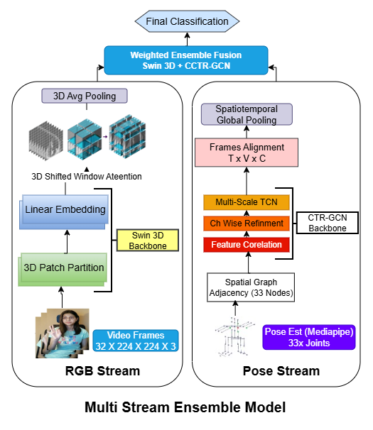

# Sign Language Interpreter using Deep Learning
> Sign language is the primary mode of communication for the hearing-impaired community. While global sign languages like ASL are well-resourced, regional languages such as Pakistan Sign Language (PSL) suffer from a lack of datasets and advancements, especially for safety-critical applications. To address this gap, we propose a Sign Language Action Recognition (SLAR) framework tailored for Safe City Surveillance to detect emergency signals and distress gestures.
   A key contribution of this work is the introduction of a new video dataset, the Lahore Garrison Institute of Special Education - Safe City Sign Dataset (LGISE-SCSD), captured under diverse environmental conditions to simulate real-world surveillance scenarios. Our methodology employs a Two-Stream Multi-Modal Ensemble, combining a Video Swin Transformer (Swin3D) for spatiotemporal feature extraction from RGB video with a Channel-Topology Refined Graph Convolutional Network (CTR-GCN) to model geometric dependencies from skeletal pose data. While Swin3D and CTR-GCN achieved standalone validation accuracies of 93.28\% and 85.99\% respectively, our optimized late fusion ensemble strategy significantly enhances performance. By effectively mitigating challenges like motion blur and background clutter, the combined framework attains a robust final recognition accuracy of 96.06\%, establishing an authenticated baseline for integrating deep learning-based sign language recognition into urban surveillance networks.. 

## Table of contents
* [General info](#general-info)
* [Dataset](#Dataset)
* [Technologies and Tools](#technologies-and-tools)
* [Preprocess](#Preprocess-Pipeline)
* [Ensemble-Model](#Ensemble-Model)
* [Features](#Features)
* [Future Work](#Future-work)

## General info

We propose an intelligent real-time sign language recognition framework specifically designed for Pakistan Sign Language (PSL), especially in safety-critical contexts of safe city surveillance systems. The system leverages state-of-the-art deep learning models and is trained on an annotated dataset that reflects the local cultural and contextual variations of PSL, including traditional and region-specific gestures.  
A multimodal sign language action recognition (SLAR) framework based on a dual-stream, RGB–skeleton architecture. The model fuses 3D-CNN appearance features with pose-based motion features to jointly exploit spatial and temporal information.
We introduce a Pakistan Sign Language video dataset captured under diverse environmental conditions to emulate real-world safe-city surveillance scenarios. The dataset was collected under the supervision of the Lahore Garrison Institute of Special Education and termed the Safe City Sign Dataset (LGISE-SCSD). It is a multi-class, annotated PSL video corpus recorded from more than 10 signers across different backgrounds and lighting conditions.

## Dataset: LGISE-SCSD
The Lahore Garrison Institute of Special Education - Safe City Sign Dataset consists of:
Total Samples: 6,193 videos.
Classes: Accident, Dangerous, Dead, Difficult, Dizzy, Scared, Violent.
Conditions: Recorded with 10+ signers across varying lighting, backgrounds, and camera angles to simulate real-world urban surveillance.
Complete dataset can be downloaded from https://www.kaggle.com/datasets/havockhan/sign-language-ident-for-safe-city-surveillance

<h3>LGISE-SCSD Dataset Statistics</h3>

<table border="1" cellpadding="8" cellspacing="0">
  <thead>
    <tr>
      <th>Statistic</th>
      <th>Value</th>
    </tr>
  </thead>
  <tbody>
    <tr>
      <td>Total videos</td>
      <td>6,193</td>
    </tr>
    <tr>
      <td>Number of classes</td>
      <td>7</td>
    </tr>
    <tr>
      <td>Average videos per class</td>
      <td>884</td>
    </tr>
    <tr>
      <td>Number of signers</td>
      <td>10+</td>
    </tr>
    <tr>
      <td>Train / Val / Test split</td>
      <td>75% / 15% / 10%</td>
    </tr>
  </tbody>
</table>

## Signs frames


## Technologies and Tools
* Python 
* TensorFlow
* Keras
* OpenCV

## Preprocessing Pipeline

To ensure consistent and robust input for both streams, we design modality-specific preprocessing pipelines.

---

### 🔷 RGB Stream (Swin3D)

- **Frame Sampling:**
  - Fixed clip length: **T = 32 frames**
  - If N > T → center crop  
  - If N < T → frame repetition (avoid zero padding)

- **Spatial Processing:**
  - Resize frames to **224 × 224**
  - Apply random cropping and ±10° rotation (augmentation)

- **Normalization:**
  - Mean: [0.432, 0.394, 0.376]  
  - Std:  [0.228, 0.221, 0.217]

- **Patch Embedding:**
  - Convert video into **3D patches (2 × 4 × 4)**
---

### 🔶 Skeleton Stream (CTR-GCN)

- **Keypoint Extraction:**
  - Use **MediaPipe Pose**
  - Extract **33 body landmarks (x, y, z)**

- **Temporal Processing:**
  - Fixed sequence length: **T = 64 frames**
  - Handle missing joints via **interpolation**

- **Data Representation:**
  - Tensor shape: **(N, C, T, V, M)**
    - N: batch size  
    - C: channels (x, y, z)  
    - T: frames  
    - V: joints (33)  
    - M: persons (1)

- **Storage Format:**
  - Save as **.npy files**

---
- Swin3D captures **visual appearance & fine-grained motion**
- CTR-GCN captures **geometric structure & joint dynamics**
- Together, they provide complementary representations for robust SLR

## Ensemble Model

Multi-Stream Ensemble Model architecture diagram showing two parallel processing streams: RGB Stream (left) with Video Frames 32 X 224 X 224 X 3 flowing through 3D Patch Partition, Linear Embedding, 3D Shifted Window Attention, and 3D Avg Pooling leading to Swin 3D Backbone; Skeleton Stream (right) with Pose Est (Mediapipe) 33x Joints flowing through Spatial Graph Adjacency, Feature Correlation, Channel Wise Refinement, and Multi-Scale TCN leading to CTR-GCN Backbone. Both streams converge at Frames Alignment T x V x C, then through Spatiotemporal Global Pooling, Multi-Scale TCN, Channel Wise Refinement, and Feature Correlation before final Weighted Ensemble Fusion Swim 3D + CTR-GCN and Final Classification.

## Multi-Modal Ensemble for Sign Language Recognition

We propose a **two-stream multi-modal ensemble network** to address SLR challenges like fine-grained hand gestures and temporal motion patterns. The framework combines:

- **RGB Stream:** Video Swin Transformer (Swin3D)  
- **Skeleton Stream:** CTR-GCN (Graph-based model)  

Both streams are fused using a **late-fusion strategy**, allowing independent optimization and effective integration of appearance-based and motion-based representations.

---

### 🔷 RGB Stream: Video Swin Transformer (Swin3D)

- Captures fine-grained hand gestures and facial cues  
- Uses **3D Shifted Window Attention** for efficient spatiotemporal modeling  
- Processes video as 3D patches (2 × 4 × 4)  
- Pretrained on Kinetics-400 and fine-tuned on LGISE-SCSD  
**Performance:**
- Validation Accuracy: **93.28%**  
---
### 🔶 Skeleton Stream: CTR-GCN

- Models body joint relationships using graph convolution  
- Uses MediaPipe Pose (33 keypoints)  
- Learns **dynamic channel-wise topology**  
- Captures long-range dependencies (e.g., hand-face interaction)  
**Performance:**
- Validation Accuracy: **85.99%**  

---

### 🔗 Multi-Modal Fusion

The final prediction combines logits from both streams using unweighted late fusion ensemble.:
| Model            | Modality            | Top-1 Accuracy | Improvement |
|-----------------|-------------------|---------------|------------|
| CTR-GCN          | Geometric (Skeleton) | 85.99%       | -          |
| Swin3D-Tiny      | Visual (RGB)        | 93.28%       | +8.48%     |
| Ensemble (Proposed) | Visual + Geometric | 96.06%       | +2.78%     |


````


## Result Analysis
We evaluated the proposed model on a balanced validation set of 623 video samples (89 per class). The ensemble achieved an overall accuracy of 96\% as shown in Tables~\ref{tab:fusion_results} and~\ref{tab:fusion_class_report}, demonstrating strong recognition performance across all sign gesture classes.

The macro-averaged precision, recall, and F1-score were also approximately 0.96, indicating consistent good results across classes without bias. Since the dataset is balanced, the weighted averages closely match the macro averages, showing stable and reliable performance of the proposed model.

## Future Work
* Expand dataset with more participants, more sign classes and Continuous sign sequences
* Move from isolated sign recognition → sentence-level recognition (Use of CTC / Seq2Seq models)
* Improve robustness by adding infrared / thermal video data and handling low-light surveillance scenarios
* Enable real-time inference by knowledge distillation
* Deploy on edge devices using light weighted models like MobileNet and MoViNet

